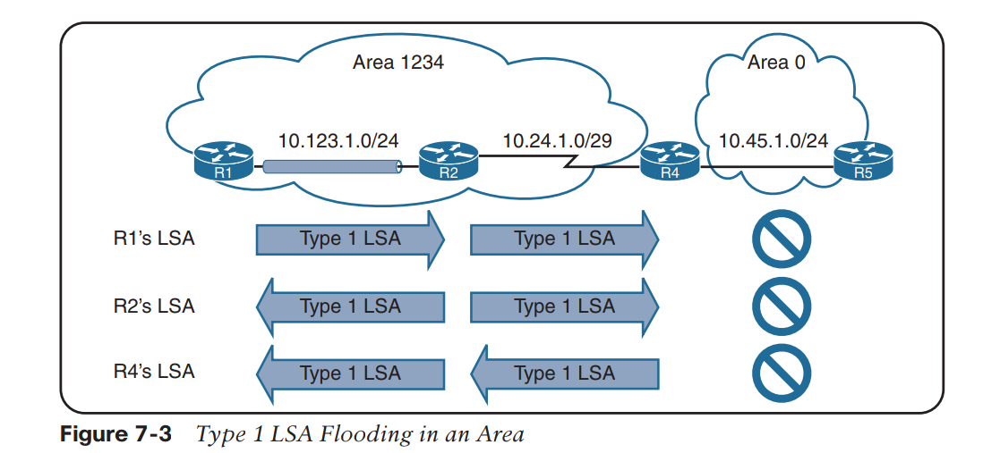
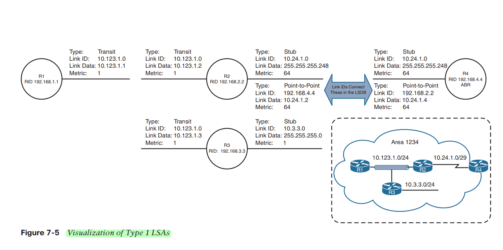
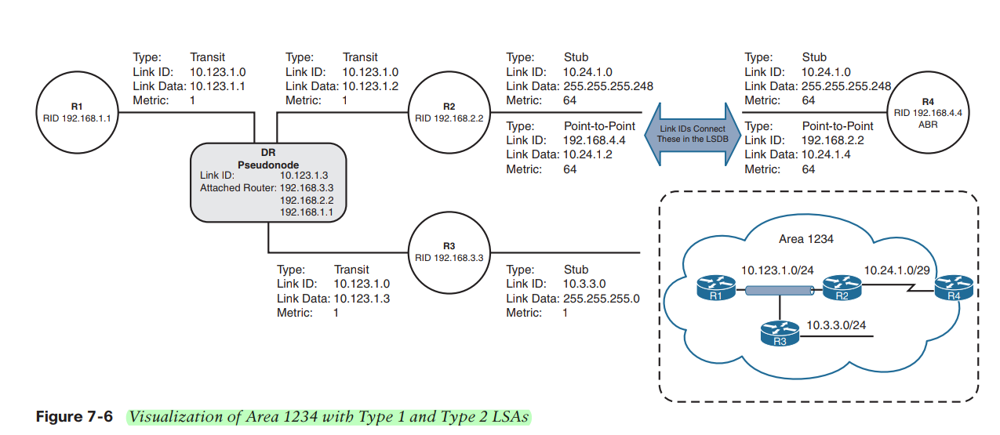
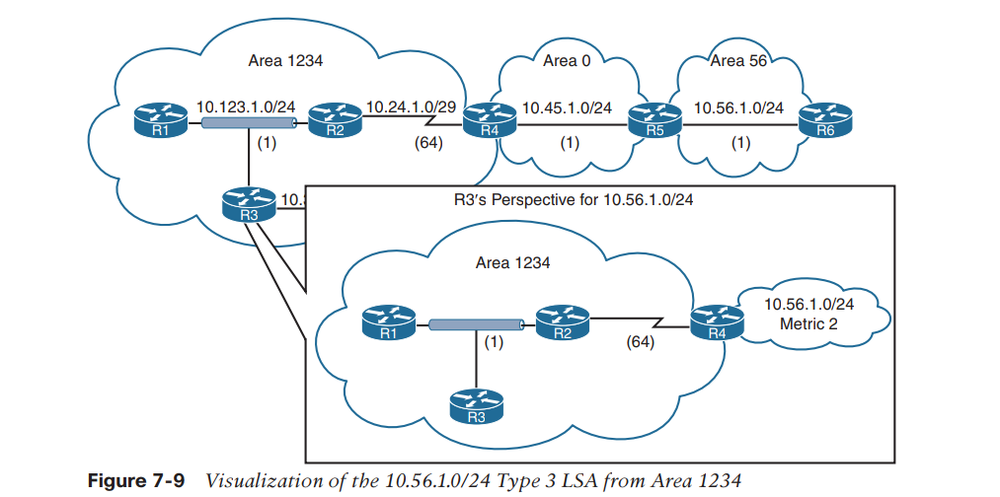
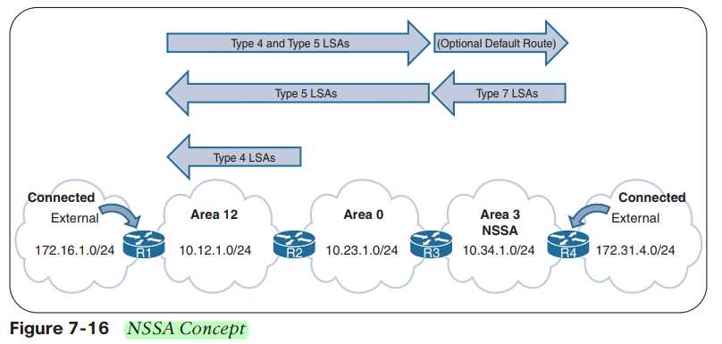

# OSPF-LSA-Types

## توضیح LAB

### در این لب روتینگ پروتکل OSPF راه اندازی شده است.HQ1وHQ2  روترهای ABR روترهای مرزی ما هستند و R4,R3,R10 روترهای ASBR هستند پون روت از دنیای بیرون Redistribute کرده اند.

---


## LSA Type for ipv4 OSPF

## Type1:Router LSA
### هر روتر یک عدد LSA Type 1 تولید می کند تا خودشو نو OSPF نشان دهد روترهای مرزی به تعداد ناحیه هایی که دارند بیش از یک عدد تولید می کنند تا موقعیت و شخصیت خودشو در هر AREA ای که دارند نشان بدهند.

###LSA Type1 از AREAها اجازه خروج ندارند پس در لب ما در AREA2 دو تا LSA Type1 داریم.

```cisco
R2#sh ip os database

            OSPF Router with ID (10.2.2.1) (Process ID 1)

                Router Link States (Area 2)

Link ID         ADV Router      Age         Seq#       Checksum Link count
1.4.4.1         1.4.4.1         127         0x80000002 0x005D1A 2
10.2.2.1        10.2.2.1        122         0x80000002 0x00B1A1 3


```

### برای دیدن جزئیات بیشتر

```cisco

R2#show ip ospf database router

            OSPF Router with ID (10.2.2.1) (Process ID 1)

                Router Link States (Area 2)

  Routing Bit Set on this LSA in topology Base with MTID 0
  LS age: 239
  Options: (No TOS-capability, DC)
  LS Type: Router Links
  Link State ID: 1.4.4.1
  Advertising Router: 1.4.4.1
  LS Seq Number: 80000002
  Checksum: 0x5D1A
  Length: 48
  Area Border Router
  Number of Links: 2

    Link connected to: another Router (point-to-point)
     (Link ID) Neighboring Router ID: 10.2.2.1
     (Link Data) Router Interface address: 1.2.2.1
      Number of MTID metrics: 0
       TOS 0 Metrics: 64

    Link connected to: a Stub Network
     (Link ID) Network/subnet number: 1.2.2.0
     (Link Data) Network Mask: 255.255.255.252
      Number of MTID metrics: 0
       TOS 0 Metrics: 64


  LS age: 234
  Options: (No TOS-capability, DC)
  LS Type: Router Links
  Link State ID: 10.2.2.1
  Advertising Router: 10.2.2.1
  LS Seq Number: 80000002
  Checksum: 0xB1A1
  Length: 60
  Number of Links: 3

    Link connected to: a Stub Network
     (Link ID) Network/subnet number: 10.2.2.0
     (Link Data) Network Mask: 255.255.255.0
      Number of MTID metrics: 0
       TOS 0 Metrics: 1

    Link connected to: another Router (point-to-point)
     (Link ID) Neighboring Router ID: 1.4.4.1
     (Link Data) Router Interface address: 1.2.2.2
      Number of MTID metrics: 0
       TOS 0 Metrics: 64

    Link connected to: a Stub Network
     (Link ID) Network/subnet number: 1.2.2.0
     (Link Data) Network Mask: 255.255.255.252
      Number of MTID metrics: 0
       TOS 0 Metrics: 64


```
### این همون حکم نقشه را دارد

## انواع Link Connected ها:

### 1- Transit: یعنی یک دست روتر رفته یکجایی Nighbor شده که باید DR انتخاب شود در روتر R2 چون اترنت نداریم پس DR نداریم.
### 2-Point-To-Point: یعنی این اینترفیس با کسی رابطه همسایگی پیدا کرده که  DR ندارد.
### 3-Stub: جاهایی هستند که رابطه همسایگی شکل نگرفته است.


### روترهایی که در Area1234 هستند مثل R1 یک LSA Type1 ساخته که Type اش از نوع Transit است چون اینجا اترنت بوده و ظاهراً سوییچ لایه 2 بوده و باید DR انتخاب میشد.در روتر های R2 و R3 هم همینطور. در مورد ارتباط R4 با R2 چون Type اش از نوع Point-to-Point بوده و لینک سریال است و این لینک ها Subnet Mask شان مشخص نمی شود برای این مورد یک  Type1 دیگری از نوع Stub هم تولید کرده است.
## Type2:Network LSA
### این نوع LSA را DR می سازد برای اینکه موقعیت خودشو در سگمنت LAN نمایش بده.LSA Type2 مثل LSA Type1 اجازه خروج از Area خودشونو ندارن و داخل همان AREA باقی می مانند.LSAType2 در شکل همان مربع وسط است(PSeudonode ) است که این دست های روتر در هوا نیستند و به وسیله این LSA Type2 به هم وصل شده اند.

###  در لب ما LSAType2  در AREA های 0 و 10 وجود دارد و اجازه خروج از Area خودشو ندارد.

```cisco
R10#sh ip ospf database

            OSPF Router with ID (10.10.10.1) (Process ID 1)

                Net Link States (Area 10)

Link ID         ADV Router      Age         Seq#       Checksum
1.10.10.1       1.10.10.1       1259        0x80000001 0x001DBE


```
###  برای دیدن جزئیات بیشتر

```cisco
R10#sh ip ospf database network

            OSPF Router with ID (10.10.10.1) (Process ID 1)

                Net Link States (Area 10)

  Routing Bit Set on this LSA in topology Base with MTID 0
  LS age: 1343
  Options: (No TOS-capability, DC)
  LS Type: Network Links
  Link State ID: 1.10.10.1 (address of Designated Router)
  Advertising Router: 1.10.10.1
  LS Seq Number: 80000001
  Checksum: 0x1DBE
  Length: 32
  **Network Mask: /30**
        Attached Router: 1.10.10.1
        Attached Router: 10.10.10.1

```
###  پس LSAType2 و LSAType1 نقشه شبکه شما است و از Area اجازه خروج ندارند پس نتیجه میگیریم که AREA های مختلف نقشه Area های متفاوت را ندارند چون LSA هاشو ندارن اگر این LSA ها به بیرون نمی رن حداقل آدرس هاشون که باید به بیرون برن.
## Type3:Summary LSA
###ABR ها یعنی روترهایی که لبه مرز بین Area ها هستند LSA های Type1,2 را که در Area غیرصفرشون است را کانورت میکنند به Type3 و می اندازند به Area0 و به این LSA Type3 ها میگن Summary LSA
### پس LSA Type3 توسط ABR ها و از روی LSAType1,2 ساخته میشود . زمانی که LSA Type3 میره و به دست ABR دیگه میرسه وظیفه این ABR این است که این LSA را دوباره Regenarate کند و خودشو به عنوان تولید کننده LSA مشخض کند و این LSA را به Area های دیگر منتقل میکند پس LSA type3 زمانی که به Area0 میاد آزادانه میتواند به Area های دیگر برود و در شبکه تو Propaket شوداین LSA type3 اطلاعات نقشه ای ندارد و آدرس هایی اند که در Area های دیگر اند.

```
R2#sh ip os da

            OSPF Router with ID (10.2.2.1) (Process ID 1)

                Summary Net Link States (Area 2)

Link ID         ADV Router      Age         Seq#       Checksum
1.0.0.0         1.4.4.1         2068        0x80000001 0x00290B
1.1.1.0         1.4.4.1         2058        0x80000001 0x00945D
1.3.3.0         1.4.4.1         1997        0x80000001 0x006687
1.4.4.0         1.4.4.1         1977        0x80000001 0x0045A7
1.10.10.0       1.4.4.1         2058        0x80000001 0x004CD2
10.1.1.0        1.4.4.1         2058        0x80000001 0x003BA9
10.3.3.0        1.4.4.1         1997        0x80000001 0x000DD3
10.4.4.0        1.4.4.1         1972        0x80000001 0x00EBF3
10.10.10.0      1.4.4.1         1955        0x80000001 0x00F21F

```
### 9 تا آدرس هست که از جای دیگه ای آمده اند.

```cisco

R2#sh ip ospf database summary

            OSPF Router with ID (10.2.2.1) (Process ID 1)

                Summary Net Link States (Area 2)

  Routing Bit Set on this LSA in topology Base with MTID 0
  LS age: 652
  Options: (No TOS-capability, DC, Upward)
  LS Type: Summary Links(Network)
  Link State ID: 1.0.0.0 (summary Network Number)
  Advertising Router: 1.4.4.1
  LS Seq Number: 80000002
  Checksum: 0x270C
  Length: 28
  Network Mask: /30
        MTID: 0         Metric: 1

  Routing Bit Set on this LSA in topology Base with MTID 0
  LS age: 652
  Options: (No TOS-capability, DC, Upward)
  LS Type: Summary Links(Network)
  Link State ID: 1.1.1.0 (summary Network Number)
  Advertising Router: 1.4.4.1
  LS Seq Number: 80000002
  Checksum: 0x925E
  Length: 28
  Network Mask: /30
        MTID: 0         Metric: 65

....

```


### آدرس 10.56.1.0/24در Area56  بوده که این آدرس advertizeش ده داخل Area0  و تبدیل به Type3 شده و بعد توسط R4  مجدداً Regenarete  شده و به سمت Area1234. از دید روتر هایی که در Area1234 انداین طور میبینند نقشه را که یک R4 وجود دارد که ABR لبه شان است و این آدرس دست این است .

## Type5:External LSA

### این LSA Type5 توسط ASBR ها ساخته میشوند و آدرس هاییEXternal ای هستند  که از دنیای بیرون redistribute شده اند تو OSPF. این LSA ها آزادانه به همه Area های داخل شبکه میتوانند بروند.

```cisco
R1#sh ip ospf database

                Type-5 AS External Link States

Link ID         ADV Router      Age         Seq#       Checksum Tag
33.3.3.0        10.3.3.1        1648        0x80000002 0x006403 0
44.4.4.0        10.4.4.1        1595        0x80000002 0x00AEA9 0
110.110.110.0   10.10.10.1      1901        0x80000002 0x0067CD 0


```
### سه تا دونه LSA-Types5 باید داشته باشم.و میتوان با جزئیات بیشتر دید:

```cisco

R1#sh ip ospf database external

            OSPF Router with ID (10.1.1.1) (Process ID 1)

                Type-5 AS External Link States

  Routing Bit Set on this LSA in topology Base with MTID 0
  LS age: 1116
  Options: (No TOS-capability, DC, Upward)
  LS Type: AS External Link
  Link State ID: 33.3.3.0 (External Network Number )
  Advertising Router: 10.3.3.1
  LS Seq Number: 80000002
  Checksum: 0x6403
  Length: 36
  Network Mask: /24
        Metric Type: 2 (Larger than any link state path)
        MTID: 0
        Metric: 20
        Forward Address: 0.0.0.0
        External Route Tag: 0

  Routing Bit Set on this LSA in topology Base with MTID 0
  LS age: 1062
  Options: (No TOS-capability, DC, Upward)
  LS Type: AS External Link
  Link State ID: 44.4.4.0 (External Network Number )
  Advertising Router: 10.4.4.1
  LS Seq Number: 80000002
  Checksum: 0xAEA9
  Length: 36
  Network Mask: /24
        Metric Type: 2 (Larger than any link state path)
        MTID: 0
        Metric: 20
        Forward Address: 0.0.0.0
        External Route Tag: 0

  Routing Bit Set on this LSA in topology Base with MTID 0
  LS age: 1369
  Options: (No TOS-capability, DC, Upward)
  LS Type: AS External Link
  Link State ID: 110.110.110.0 (External Network Number )
  Advertising Router: 10.10.10.1
  LS Seq Number: 80000002
  Checksum: 0x67CD
  Length: 36
  Network Mask: /24
       ** Metric Type: 2 (Larger than any link state path) **
        MTID: 0
        ** Metric: 20 **
        Forward Address: 0.0.0.0
        External Route Tag: 0
```

## Type4:ASBR Summary LSA
### این LSA جای ASBR را در شبکه ما مشخص می کند و خود ASBBR نمی سازد ABR لبه Area می سازد. ASBR ما LSA Type5  که تولید کرد و رسید به ABR لبه Area این ABR یکدونه Type4 هم می سازد مه به روترهای دیگر شبکه بفماند که ASBR اینجاست . پس من در R2 نگاه کنم سه عدد از این نوع LSA میبینم که موقعیت ASBR ها را نشان میدهد.

```cisco
R2#show ip ospf database
                Summary ASB Link States (Area 2)

Link ID         ADV Router      Age         Seq#       Checksum
10.3.3.1        1.4.4.1         1867        0x80000002 0x00E8F5
10.4.4.1        1.4.4.1         1867        0x80000002 0x00C716
10.10.10.1      1.4.4.1         1867        0x80000002 0x00CE41

R4#sh ip ospf database
                Summary ASB Link States (Area 4)

Link ID         ADV Router      Age         Seq#       Checksum
10.3.3.1        1.4.4.1         1431        0x80000002 0x00E8F5
10.10.10.1      1.4.4.1         1431        0x80000002 0x00CE41

```
### برای دیدن جزئیات بیشتر

```cisco
R4#sh ip ospf database asbr-summary

            OSPF Router with ID (10.4.4.1) (Process ID 1)

                Summary ASB Link States (Area 4)

  Routing Bit Set on this LSA in topology Base with MTID 0
  LS age: 1592
  Options: (No TOS-capability, DC, Upward)
  LS Type: Summary Links(AS Boundary Router)
  Link State ID: 10.3.3.1 (AS Boundary Router address)
  Advertising Router: 1.4.4.1
  LS Seq Number: 80000002
  Checksum: 0xE8F5
  Length: 28
  Network Mask: /0
        MTID: 0         Metric: 65

  Routing Bit Set on this LSA in topology Base with MTID 0
  LS age: 1592
  Options: (No TOS-capability, DC, Upward)
  LS Type: Summary Links(AS Boundary Router)
  Link State ID: 10.10.10.1 (AS Boundary Router address)
  Advertising Router: 1.4.4.1
  LS Seq Number: 80000002
  Checksum: 0xCE41
  Length: 28
  Network Mask: /0
        MTID: 0         Metric: 2
```
## Type7:NSSA External
###  این LSA مخصوص Area هایی از نوع NSSA است. چون در این Area ها قراره LSA Type5 را نداشته باشیم ولی در این Area ما روترهایی داریم که ASBR است و ASBR به جای Type5 باید Type7 تولید کند و ABR این Type7 را تبدیل به type5 می کند و وقتی این type5 به ABR دیگر میرسد Type4 اش اونجا تولید میشود.

### در اینجا یک آدرس external بوده که روتر R4 اونو Redistribute کرده و نوع Area اش NSSA بوده پس به جای LSA Ty pe5 یک LSA Type7 تولید میکند و این Type7 j تو ABR تبدیل به Type5 می شود و Type5 وارد Area0  میشود و زمانی که به ABR دیگه میرسد LSA type4 اونحا ساخته می شود و دگه این Type5,4 تو شبکه میرن جلو.
