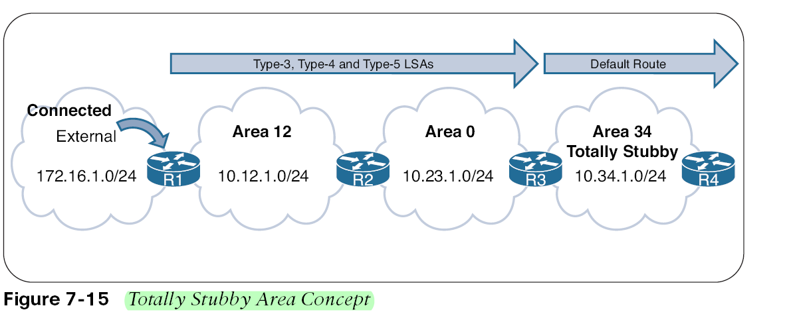
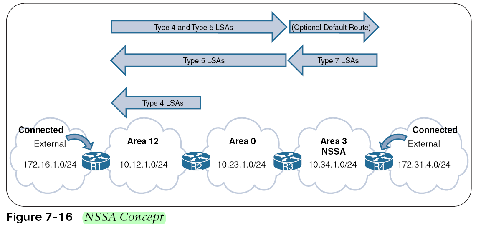
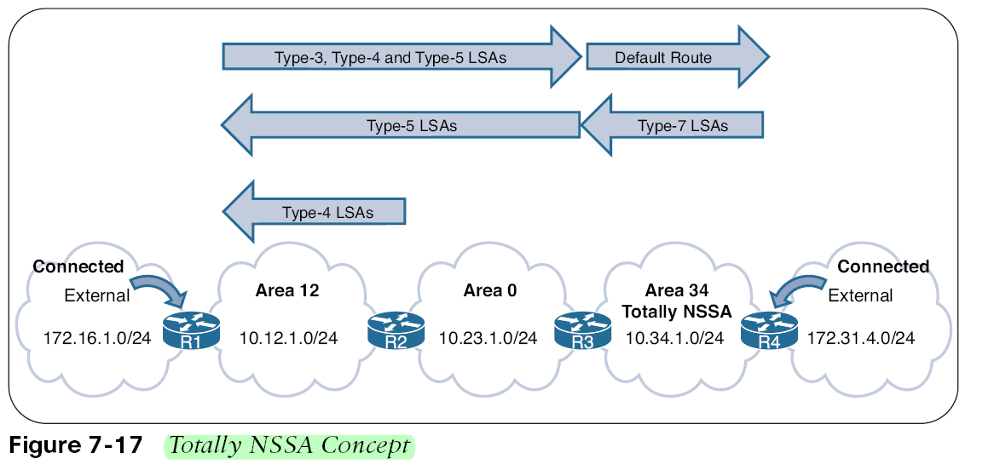

# Area Type

### Area0 از نوع BackBone Area است و بقیه Area ها از نوع Normal Area هستند که میتوانند از حالت نرمال خارج شوند با دستور و یکی از حالتهای زیر شوند:

## Stub Area

### اگر Area34 را تبدیل به stub کنیم LSA type4,5 اجازه ورود به این Area را ندارند، یعنی روت های Extenal فیلتر میشن و به جاش یک دیفالت روت میره به Area مورد نظر.

---
### در این LAB ما میخواهیم Area1 را به Area Stub تبدیل کنیم.

```cisco

R1(config)#router ospf 1
R1(config-router)#area 1 stub

HQ-1(config)#router ospf 1
HQ-1(config-router)#area 1 stub

HQ-1#show ip ospf

 Number of areas in this router is 4. 3 normal 1 stub 0 nssa
  Area 1
        Number of interfaces in this area is 1
        It is a stub area


```
### حالا LSA Type4,5 داخل روترهای این Area  نباید باشند.

```cisco
R1#show ip ospf database

            OSPF Router with ID (10.1.1.1) (Process ID 1)

                Router Link States (Area 1)

Link ID         ADV Router      Age         Seq#       Checksum Link count
1.10.10.1       1.10.10.1       381         0x80000005 0x003D27 2
10.1.1.1        10.1.1.1        384         0x80000005 0x0069E6 3

                Summary Net Link States (Area 1)

Link ID         ADV Router      Age         Seq#       Checksum
0.0.0.0         1.10.10.1       386         0x80000001 0x000C1C
1.0.0.0         1.10.10.1       386         0x80000002 0x00EA3E
1.2.2.0         1.10.10.1       386         0x80000002 0x003FA5
1.3.3.0         1.10.10.1       386         0x80000002 0x001EC5
1.4.4.0         1.10.10.1       386         0x80000002 0x0011CF
1.10.10.0       1.10.10.1       386         0x80000002 0x000411
10.2.2.0        1.10.10.1       386         0x80000002 0x00E5F1
10.3.3.0        1.10.10.1       386         0x80000002 0x00C412
10.4.4.0        1.10.10.1       386         0x80000002 0x00B71C
10.10.10.0      1.10.10.1       386         0x80000002 0x00AA5D


```
### به جای روت های External یک دیفالت روت وارد روتینگ تیبل شده

```cisco

R1#show ip route

O*IA  0.0.0.0/0 [110/65] via 1.1.1.1, 00:08:57, Serial2/1

```

## کاربرد Area های Stub این است که Area های سبک داشته باشیم که روت کمتری داخلش باشند.خفنی OSPF

## Totally Stubby Area


### در این شکل در Area34  ما LSA-Types3,4,5 اجازه ورود ندارند و به جاش یک دیفالت روت داره تا کانکتیویتی اش قطع نشود و OSPF ران است و سبک است.

### در این لب ما Area2 را تبدیل به totally Stubbly می کنیم

```cisco

R2(config)#router ospf 1
R2(config-router)#area 2 stub

HQ-2(config)#router ospf 1
HQ-2(config-router)#area 2 stub no-summary

HQ-2#sh ip ospf
Number of areas in this router is 3. 2 normal 1 stub 0 nssa
  Area 2
        Number of interfaces in this area is 1
        It is a stub area, no summary LSA in this area


```

### تایپ 1 را دارد و یک تایپ 3 که همون دیفالت روت است.

```cisco

R2#sh ip ospf database

            OSPF Router with ID (10.2.2.1) (Process ID 1)

                Router Link States (Area 2)

Link ID         ADV Router      Age         Seq#       Checksum Link count
1.4.4.1         1.4.4.1         218         0x80000004 0x0077FF 2
10.2.2.1        10.2.2.1        220         0x80000004 0x00CB87 3

                Summary Net Link States (Area 2)

Link ID         ADV Router      Age         Seq#       Checksum
0.0.0.0         1.4.4.1         222         0x80000001 0x0066CD

```
### و در روتینگ تیبل فقط یک دیفالت روت را دارد

```cisco

R2#sh ip route

Gateway of last resort is 1.2.2.1 to network 0.0.0.0

O*IA  0.0.0.0/0 [110/65] via 1.2.2.1, 00:06:15, Serial2/2
      1.0.0.0/8 is variably subnetted, 3 subnets, 2 masks
C        1.2.2.0/30 is directly connected, Serial2/2
C        1.2.2.1/32 is directly connected, Serial2/2
L        1.2.2.2/32 is directly connected, Serial2/2
      10.0.0.0/8 is variably subnetted, 2 subnets, 2 masks
C        10.2.2.0/24 is directly connected, FastEthernet0/0
L        10.2.2.1/32 is directly connected, FastEthernet0/0

```

### اگر در یک نتورک بزرگ OSPF راه اندازی بکنیم اون نقشه ی گنده میشود و همه روترهای باید قوی باشن با این روش Area هایی درست میکنیم که سبک باشن و بتوان روترهای ضعیف هم داخلش قرار داد.

### در لب ما وقتی یک Area  را stub میکنیم در واقع می گوییم که LSA   های Type4,5 اجازه ورود نداشته باشند در Area3 چون روتر R3 ما ASBR است و باید 5 را تولید کند و چون Stub کرده ایم روترهای دیگه میگن ما Atub ایم و این 5 را کی تولید کرده؟
 
## Not-So-Stubby

### یک جور Area از نوع stub است ولی یک ASBR داخل این Area دارم و این ASBR به جای تولید LSA Type 5 میاد LSA Type7 تولید میکند و وقتی این 7 دست ABR لبه Area می رسد 7 را کانورت می کند به 5 و این 5 را وارد Area های دیگر می کند و وقتی این 5 از لبه ABR میخواد وارد Area دیگر شود 4 اش اونجا تولید می شه طبق شکل زیر:

### در اینجا یک آدرس External بوده که روتر R4 اونو Redistribute کرده و Area اش یک Area از نوع NSSA بوده پس LSA ای که این روترR4 تولید میکند type7 است و 7 میاد در لبه Area و ABR این 7 را تبدیل به 5 میکند و 5 وارد Area 0  میشود و وقتی این 5 به ABR دیگه در Area0  میرسد LSA Type4 اش اونجا تولید می شود  و دیگه این 5 و 4 میرن جلو مگر اینکه به Area ای برسن که Stub باشه و اونجا اجازه ورود ندارن برخلاف Area های Stub که دیفالت روت میرفت توش تو Area های از نوع NSSA دیفالت روت اپشنال هست.

### در این لب Area3  را میخواهم تبدیل به NSSA کنم چون روتری داخلش دارم که روت Redistribute کرده است.

```cisco
R3(config)#router ospf 1
R3(config-router)#area 3 nssa

HQ-1(config)#router ospf 1
HQ-1(config-router)#area 3 nssa


HQ-1#sh ip ospf

Number of areas in this router is 4. 2 normal 1 stub 1 nssa
 Area 3
        Number of interfaces in this area is 1
        It is a NSSA area

```

###  LSA Type4,5 اجازه ورود به این Area را ندارند. به جاش یک LSA type7 داریم. یعنی روتر R3 نتورک external اش رو با type7 تولید کرده است.

```cisco

R3#sh ip ospf database

            OSPF Router with ID (10.3.3.1) (Process ID 1)

                Router Link States (Area 3)

Link ID         ADV Router      Age         Seq#       Checksum Link count
1.10.10.1       1.10.10.1       266         0x80000006 0x006FDD 2
10.3.3.1        10.3.3.1        265         0x80000006 0x00AF81 3

                Summary Net Link States (Area 3)

Link ID         ADV Router      Age         Seq#       Checksum
1.0.0.0         1.10.10.1       272         0x80000003 0x0070AF
1.1.1.0         1.10.10.1       272         0x80000003 0x00D10D
1.2.2.0         1.10.10.1       272         0x80000003 0x00C417
1.4.4.0         1.10.10.1       272         0x80000003 0x009641
1.10.10.0       1.10.10.1       272         0x80000003 0x008982
10.1.1.0        1.10.10.1       272         0x80000003 0x007859
10.2.2.0        1.10.10.1       272         0x80000004 0x006964
10.4.4.0        1.10.10.1       272         0x80000003 0x003D8D
10.10.10.0      1.10.10.1       272         0x80000003 0x0030CE

                Type-7 AS External Link States (Area 3)

Link ID         ADV Router      Age         Seq#       Checksum Tag
33.3.3.0        10.3.3.1        296         0x80000001 0x004411 0

```
## برای دیدن جزئیات بیشتر

```cisco
R3#sh ip ospf database nssa-external

            OSPF Router with ID (10.3.3.1) (Process ID 1)

                Type-7 AS External Link States (Area 3)

  LS age: 462
  Options: (No TOS-capability, Type 7/5 translation, DC, Upward)
  LS Type: AS External Link
  Link State ID: 33.3.3.0 (External Network Number )
  Advertising Router: 10.3.3.1
  LS Seq Number: 80000001
  Checksum: 0x4411
  Length: 36
  Network Mask: /24
        Metric Type: 2 (Larger than any link state path)
        MTID: 0
        Metric: 20
        Forward Address: 1.3.3.2
        External Route Tag: 0
```
### درسته تایپ 7 تولید کرده ولی من در روتر R10  تایپ 5 را دارم.

###  اگر دیفالت روت را لازمش داریم برای این کار در روتر  لبه Area دستور زیر را باید بزنیم

```cisco

HQ-1(config)#router ospf 1
HQ-1(config-router)#area 3 nssa default-information-originate

R3#sh ip route

O*N2  0.0.0.0/0 [110/1] via 1.3.3.1, 00:00:06, Serial2/3
      1.0.0.0/8 is variably subnetted, 8 subnets, 2 masks

```
### انواع روت ها داخل روتینگ تیبل:
### O  از روی LSA Type1,2  ساخته شده Intera Area
### O IA از روی LSA type 3  ساخته شده Inter Area
### O E1  از روی LSA type4&5  ساخته شده External type1
### O E2  از روی LSA type4&5  ساخته شده External type2 دیفالت این بوده.
### O N1 از روی LSA type7  ساخته میشن External type1
### O N2 از روی LSA type7  ساخته میشن External type2

##Totally NSSAS

### شبیه Totally Stubby است و LSA Type 3,4,5 واردش نمی شود.


### اگرArea34 را تبدیل به Totally Stubby کنیم طبق معمول 3و4و5 اجازه ورود به این area را ندارند و به جاش دیفالت روت میره و روتری که ASBR است LSA Type7 تولید میکند و 7 میخوره به ABR لبه Area و میشه 5 و 5 وارد Area0  میشود و این ،Type5 در ABR بعدی اش، Type4  اش تولید میشود و 4و 5 وارد Area های دیگر میشود خلاصه 3و4و5 اجازه ورود به این Area را ندارند اما یک روتری داخل این Area داریم که روت Redistribute میکند.

### در این لب ما Area4 را تبدیل به Totally NSSA میکنیم.

```cisco
R4(config)#router ospf 1
R4(config-router)#area 4 nssa

HQ-2(config)#router ospf 1
HQ-2(config-router)#area 4 nssa no-summary

HQ-2#sh ip ospf
 Number of areas in this router is 3. 1 normal 1 stub 1 nssa
 Area 4
        Number of interfaces in this area is 1
        It is a NSSA area
        Perform type-7/type-5 LSA translation

```
###  برای دیدن جزئیات بیشتر

```cisco

R4#show ip ospf database

            OSPF Router with ID (10.4.4.1) (Process ID 1)

                Router Link States (Area 4)

Link ID         ADV Router      Age         Seq#       Checksum Link count
1.4.4.1         1.4.4.1         109         0x80000007 0x00A5B8 2
10.4.4.1        10.4.4.1        110         0x80000006 0x00A68C 3

                Summary Net Link States (Area 4)

Link ID         ADV Router      Age         Seq#       Checksum
0.0.0.0         1.4.4.1         114         0x80000001 0x00ED3E

                Type-7 AS External Link States (Area 4)

Link ID         ADV Router      Age         Seq#       Checksum Tag
44.4.4.0        10.4.4.1        137         0x80000001 0x00A79C 0

```
###  یک type3 دارد که اون دیفالت روته است 

## روتینگ تیبل کاملا خلوت است.

```cisco
R4#sh ip route


O*IA  0.0.0.0/0 [110/65] via 1.4.4.1, 00:04:11, Serial2/4
      1.0.0.0/8 is variably subnetted, 3 subnets, 2 masks
C        1.4.4.0/30 is directly connected, Serial2/4
C        1.4.4.1/32 is directly connected, Serial2/4
L        1.4.4.2/32 is directly connected, Serial2/4
      10.0.0.0/8 is variably subnetted, 2 subnets, 2 masks
C        10.4.4.0/24 is directly connected, FastEthernet0/0
L        10.4.4.1/32 is directly connected, FastEthernet0/0
      44.0.0.0/24 is subnetted, 1 subnets
S        44.4.4.0 is directly connected, Null0

HQ-2#sh ip route
O N2     44.4.4.0 [110/20] via 1.4.4.2, 00:06:38, Serial2/4
      110.0.0.0/24 is subnetted, 1 subnets


```
