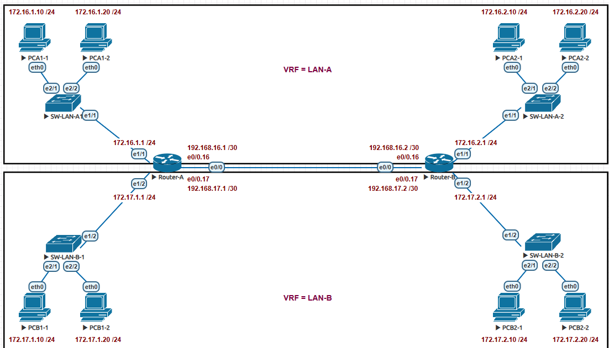

#  OSPF-VRF



### ارتباطات وسط ترانک است و دو تا ساب اینترفیس با تگ های 16و17 در دو روتر ساخته شده است.قسمت بالای شبکه در VRF LAN-A و قسمت پایین شبکه در VRF LAN-B قرار داده شده است.حالا میخواهیم OSPF راه اندازی بکنیم.
---
```cisco

Router-A#sh ip vrf
  Name                             Default RD            Interfaces
  LAN-A                            <not set>             Et0/0.16
                                                         Et1/1
  LAN-B                            <not set>             Et0/0.17
                                                         Et1/2
Router-B#sh ip vrf
  Name                             Default RD            Interfaces
  LAN-A                            <not set>             Et0/0.16
                                                         Et1/1
  LAN-B                            <not set>             Et0/0.17
                                                         Et1/2
```

### راه اندازی OSPF  در VRF

```cisco

Router-A(config)#router ospf 1 vrf LAN-A
Router-A(config-router)#network 0.0.0.0 255.255.255.255 area 0
Router-A(config-router)#exit
Router-A(config)#router ospf 2 vrf LAN-B
Router-A(config-router)#network 0.0.0.0 255.255.255.255 area 0
Router-A(config-router)#exit


```
### با پراسس ID متفاوت OSP را رآن می کنیم.و در روتر بعد هم همین دستورات را می زنیم.

```cisco
      
Router-B(config)#router ospf 1 vrf LAN-A
Router-B(config-router)#network 0.0.0.0 255.255.255.255 area 0
Router-B(config-router)#exit

%OSPF-5-ADJCHG: Process 1, Nbr 192.168.16.1 on Ethernet0/0.16 from LOADING to FULL, Loading Done

Router-B(config)#router ospf 2 vrf LAN-B
Router-B(config-router)#network 0.0.0.0 255.255.255.255 area 0

*May  7 14:17:46.314: %OSPF-5-ADJCHG: Process 2, Nbr 192.168.17.1 on Ethernet0/0.17 from LOADING to FULL, Loading Done

```

### دستورات verification:

```cisco

Router-A#show ip ospf neighbor

Neighbor ID     Pri   State           Dead Time   Address         Interface
192.168.17.2      1   FULL/BDR        00:00:34    192.168.17.2    Ethernet0/0.17
192.168.16.2      1   FULL/BDR        00:00:34    192.168.16.2    Ethernet0/0.16

Router-A#sh ip ospf interface brief
Interface    PID   Area            IP Address/Mask    Cost  State Nbrs F/C
Et1/2        2     0               172.17.1.1/24      10    DR    0/0
Et0/0.17     2     0               192.168.17.1/30    10    DR    1/1
Et1/1        1     0               172.16.1.1/24      10    DR    0/0
Et0/0.16     1     0               192.168.16.1/30    10    DR    1/1

Router-A#sh ip route vrf LAN-A

Routing Table: LAN-A


      172.16.0.0/16 is variably subnetted, 3 subnets, 2 masks
C        172.16.1.0/24 is directly connected, Ethernet1/1
L        172.16.1.1/32 is directly connected, Ethernet1/1
O        172.16.2.0/24 [110/20] via 192.168.16.2, 00:05:50, Ethernet0/0.16
      192.168.16.0/24 is variably subnetted, 2 subnets, 2 masks
C        192.168.16.0/30 is directly connected, Ethernet0/0.16
L        192.168.16.1/32 is directly connected, Ethernet0/0.16

Router-A#sh ip route vrf LAN-B

Routing Table: LAN-B

      172.17.0.0/16 is variably subnetted, 3 subnets, 2 masks
C        172.17.1.0/24 is directly connected, Ethernet1/2
L        172.17.1.1/32 is directly connected, Ethernet1/2
O        172.17.2.0/24 [110/20] via 192.168.17.2, 00:05:58, Ethernet0/0.17
      192.168.17.0/24 is variably subnetted, 2 subnets, 2 masks
C        192.168.17.0/30 is directly connected, Ethernet0/0.17
L        192.168.17.1/32 is directly connected, Ethernet0/0.17

```
###  نتیجه این که PCA1-1 پینگ PCA2-1را باید داشته باشد.