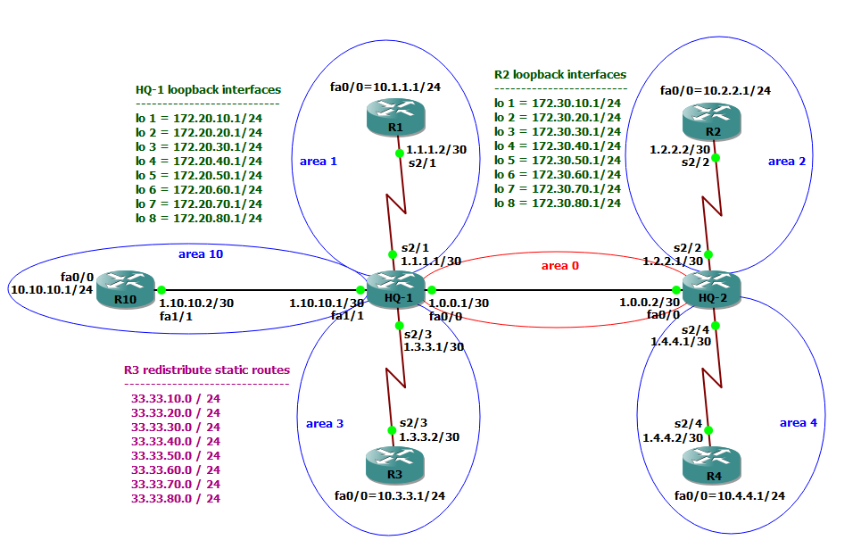

## Summarization Of Route
### خواص و ویژگی های روت سامریزیشن که قبلا هم گفته شده شامل روتینگ تیبل کوچکتر، حجم توپولوژی دیتابیس کوچکتر، حجم آپدیت ها کم می شود اگر لینکی داخل Area ای فلپ شود در داخل Area های دیگه فلپ نمی شود چون آپدیته نمی ره  و روت سامری را دارند.همچنین برای جلوگیری از Loop یک روت به Null صفر می زنند روتری که روت را سامری می کند.


###  در این شبکه OSPF راه اندازی شده برای اینکه تعدادی آدرس را سامری کنیم داخل روتر R2 اینترفیس های LoopBack ساخته ایم 8 تا آدرس که محل تولدیشان Area2 است البته OSPF با این آدرسها /32 ای رفتار می کند. همچنین در Hq1 هم تعدادی LoopBack ساخته ایم که محل تولدشان Area0 است که میتوانست تو Area 1,10,3 هم باشد.
### در OSPF برخلافEIGRP فقط ABR ها اجازه Summryzation را دارند  منطق اش اینه که روت هایی که متعلق به Area2  هستند سامری شن و برن به Area0 که این ها می شن Area Type3 که مثلا 5 تا روت سامری شن به یه دونه روت.پس براساس Area میتوان سامری کرد. الان من یه تعدادی آدرس در روتر R2 دارم که این آدرس ها را در همه جای شبکه ام دارم.
```cisco
R3#sh ip route

      172.30.0.0/32 is subnetted, 8 subnets
O IA     172.30.10.1 [110/130] via 1.3.3.1, 00:01:24, Serial2/3
O IA     172.30.20.1 [110/130] via 1.3.3.1, 00:01:24, Serial2/3
O IA     172.30.30.1 [110/130] via 1.3.3.1, 00:01:24, Serial2/3
O IA     172.30.40.1 [110/130] via 1.3.3.1, 00:01:24, Serial2/3
O IA     172.30.50.1 [110/130] via 1.3.3.1, 00:01:24, Serial2/3
O IA     172.30.60.1 [110/130] via 1.3.3.1, 00:01:24, Serial2/3
O IA     172.30.70.1 [110/130] via 1.3.3.1, 00:01:24, Serial2/3
O IA     172.30.80.1 [110/130] via 1.3.3.1, 00:01:24, Serial2/3
```

### برای سامری اینها باید در ABR لبه Area انجام داد
```cisco

HQ-2(config)#router ospf 1
HQ-2(config-router)#area 2 range 172.30.0.0 255.255.0.0
```
###  اول Area ای که محل تولد روت هاست را مینویسیم بعد محدوده سامری را مشخص می کنیم.
```cisco
R3#sh ip route

O IA  172.30.0.0/16 [110/130] via 1.3.3.1, 00:01:41, Serial2/3


R3#sh ip os database

		Summary Net Link States (Area 3)
172.30.0.0      1.10.10.1       184         0x80000001 0x004CCD
```
## نکته: پس Summarization در LSA Type 3 اتفاق می افتد.همپنین برای سامری کردن روت هایی که محل تولدشون Area صفر است برای سامری کردن اینها باید در همه ABR ها زده شود 

### اگر دستور سامری را فقط در HQ1 بزنیم در جهات Area1,10,3 سامری میشن.پس روت هایی که متعلق به Area0 اند در همه ABR ها باید زده شود.
```cisco
HQ-1(config)#router ospf 1
HQ-1(config-router)#area 0 range 172.20.0.0 255.255.0.0

R1#sh ip route
O IA  172.20.0.0/16 [110/65] via 1.1.1.1, 00:01:04, Serial2/1

HQ-2(config)#router ospf 1
HQ-2(config-router)#area 0 range 172.20.0.0 255.255.0.0

O IA  172.20.0.0/16 [110/66] via 1.2.2.1, 00:00:16, Serial2/2

HQ-1#sh ip ospf

Area BACKBONE(0)
        Number of interfaces in this area is 9 (8 loopback)
        Area has no authentication
        SPF algorithm last executed 00:05:06.300 ago
        SPF algorithm executed 5 times
        Area ranges are
           172.20.0.0/16 Active(1) Advertise
		   
HQ-2#sh ip ospf

 Area 2
        Number of interfaces in this area is 1
        Area has no authentication
        SPF algorithm last executed 00:03:19.056 ago
        SPF algorithm executed 5 times
        Area ranges are
           172.30.0.0/16 Active(65) Advertise

```

### وقتی ما تعدادی روت را سامری میکنیم اون روت سامری متریک کوچکترین آبجکت خودشو بر می داره این خیلی خوب نیست ما سامری کردیم که اگر نتورکی دان شه دیگه آپدیتی تولید نشود ولی اگر آدرسی که متریک کوچکتر دارد دان شود متریک کوچکتر از آن باید انتخاب شه و دوباره روتر آپدیت میده راهکار متریک روت سامری را خودمان دستی بدهیم

```cisco

R4#sh ip route

O IA  172.30.0.0/16 [110/129] via 1.4.4.1, 00:53:20, Serial2/4

HQ-2(config)#router ospf 1
HQ-2(config-router)#area 2 range 172.30.0.0 255.255.0.0 cost 200

R4#sh ip route

O IA  172.30.0.0/16 [110/264] via 1.4.4.1, 00:00:05, Serial2/4

```
## تکلیف آدرس های External

### در این لب روتر R3  روتر ASBR است و آدرسهایی را Redistribute کرده به عنوان روت Externalکه LSA Type5 می شهاین ها را در ABR نمیتوان سامری کرد چون ABR ها عملیات سامری در LSA Type 1,2,3 اتفاق می افتد نه LSA Type5 اگر تصمیم داریم که سامری کنیم باید در خود ASBR مربوطه سامری کرد و دستورش فرق می کند.
```cisco
R3(config)#router ospf 1
R3(config-router)#summary-address 33.33.0.0 255.255.0.0

R2#sh ip route

O E2     33.33.0.0 [110/20] via 1.2.2.1, 00:00:26, Serial2/2

 ```
### در HQ-2 ما دو تا دستور سامری زده بودیم پس:

```cisco
HQ-2#sh ip route

O        172.30.0.0/16 is a summary, 00:09:46, Null0
O        172.20.0.0/16 is a summary, 00:09:46, Null0

```