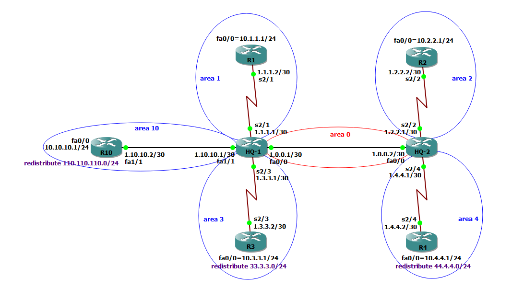

## OSPF Route Filtering

### summrization و route filternig  در لبه Area اتفاق می افتد. روی اینترفیس یا هرجایی که دلمون بخواد نمیشه.به خاطر اینکه LSDB روترها داخل Area باید یکسان باشداگر وسط Area روت فیلترینگ انجام بدهیم نقشه یکی نمی شه و اشکال در مسیریابی اتفاق می افتد.مثلا میتوان آدرس LAN شبکه روتر R2 را به Area0، ادورتایز نکن و یا این آدرس را داخل Area3 توسط HQ-1 ادورتایز نکن.گس براساس Area و روی لبه Area اتفاق می افتد.

### سه روش برای این کار وجود دارد:

## 1- استفاده از دستور summraziation: این دستور یک کیورد در انتهاش داره که اگر بزنیم روته را adv نمی کند و عملا فیلترش می کنیم.اگرجه این روش محدودیت های زیادی دارد.

###  در این شبکه OSPF راه اندازی شده و می خواهیم آدرس LAn روتر R2 که در Area2 است به سمت Area0 دیگه Adv نشه و فیلتر شه درواقع این آدرس اصلا وارد Area0 من نشه.

```cisco

R4#sh ip route
O IA     10.2.2.0/24 [110/129] via 1.4.4.1, 00:00:39, Serial2/4

HQ-2(config)#router ospf 1
HQ-2(config-router)#area 2 range 10.2.2.0 255.255.255.0 not-advertise

R4#sh ip route

```

### الان روترهایی که داخل Area دیگه هستند این روت را یاد نمی گیرند و این روت از Area خودش بیروت نمیره. این روش محدودیت هایی مثل آدرس LAN به فقط به Area4 نیاد به بقیه Area ها بیاد

## 2- استفاده از Area Filter: که با استفاده از perfix-list انجام میدهیم و با ACL نمیشه. به عنوان مثال میخواهیم سابنت لن روتر R1 در Area1 وارد Area4 نشود.می یاییم در ABR لبه Area اونجایی که می خواهیم فیلترینگ اتفاق بیقتد:

```cisco

HQ-2(config)#ip prefix-list HAMED deny 10.1.1.0/24
HQ-2(config)#ip prefix-list HAMED permit 0.0.0.0/0 le 32
HQ-2(config)#router ospf 1
HQ-2(config-router)#area 4 filter-list prefix HAMED in

```
###  شماره Area ای که میخواهیم فیلتر روش اتفاق بیفته. in یعنی این Prefix List موقعی که آدرس ها وارد Area4 بشوند فیلتر شن چون می خواهیم این سابت وارد area4 نشود در وردی این area4  اتفاق می افتد.

```cisco
HQ-2#show ip ospf

    Area 4
        Number of interfaces in this area is 1
        Area ranges are
        Area-filter HAMED in

```
## روش سوم:Distribute-List: در OSPF فقط در ورودی کار می کند دایرکشن In و route را از روتینگ حذف می کند ولی LSA آن حذف نمی شود و از بقیه روترها هم حذف نمی شود.و به بقیه هم یاد می دهد و به این روش لوکال فیلترینگ هم میگن و در هرجای شبکه می توان انجام داد چون کاری به نقشه و LSDB ندارد.

```cisco

R3#sh ip route

O E2     44.4.4.0 [110/20] via 1.3.3.1, 00:21:33, Serial2/3

R3(config)#access-list 25 deny 44.4.4.0 0.0.0.255
R3(config)#access-list 25 permit any

R3(config)#router ospf 1
R3(config-router)#distribute-list 25 in
R3(config-router)#exit

R3#sh ip route

R3#sh ip ospf database

              Type-5 AS External Link States

Link ID         ADV Router      Age         Seq#       Checksum Tag
33.3.3.0        10.3.3.1        1441        0x80000001 0x006602 0
44.4.4.0        10.4.4.1        1425        0x80000001 0x00B0A8 0

```

###  در LSDB هست فقط روت را نزاشته تو روتینگ تیبلت.
### اگر در R4 گفته باشم که 44.4.4.0 را نزار تو روتینگ تیبلت و این روتر به روتر دیگری وصل باشه این R4 این رنج را به اون روتر یاد میده و موقع ارسال ترافیک ازاون روتر چون مسیری این روتر ندارد ترافیک نمیره، در روتر های انتهایی این روش کاربرد دارد.
### اگر با این روش Distribute-list بیام و روت فیلترینگ انجام بدم LSA های تایپ1 وقتی تبدیل به تایپ3 میشن Distribute-list جلوشونو نمیگیره و تبدیل می شن مثلا:
```cisco

HQ-2#sh ip route

O        10.4.4.0 [110/65] via 1.4.4.2, 00:36:13, Serial2/4


HQ-2(config)#access-list 35 deny 10.4.4.0 0.0.0.255
HQ-2(config)#access-list 35 permit any
HQ-2(config)#router ospf 1
HQ-2(config-router)#distribute-list 35 in

HQ-2#sh ip route

HQ-1#sh ip route
O IA     10.4.4.0 [110/66] via 1.0.0.2, 00:31:34, FastEthernet0/0


```
###  ولی این آدرس 10.4.4.0 را که  LSA Type1 بود و در Area4 میخوره به HQ-2 و میشه Type3 این تایپ3 میرسه به دست تون یکی ABR یعنی HQ-1 اگر من در اونجا هم Local filter انجام بدهم برای 10.4.4.0  دیگه LSA  اش به اون یکی Area ها نمیره(چیز عجیب) به خاطر اینکه عملیات رفتن LSA به Area های دیگه بغد از لوکال فیلتر تو اتفاق می افته پس LSA type3 هایی که دارن ریجنریت میشن اگر لوکال فیلتر کنیم ریجنریت نمی شن پس:

```cisco

HQ-1(config)#access-list 52 deny 10.4.4.0 0.0.0.255
HQ-1(config)#access-list 52 permit any
HQ-1(config)#router ospf 1
HQ-1(config-router)#distribute-list 52 in
HQ-1(config-router)#exit
HQ-1#sh ip route

R1#sh ip route

R3#sh ip route

R10#sh ip route

 ```
### اتفاق شگقت انگیز اینکه R1,3,10  هم این 10.4.4.0 را ندارن.چون ریجنریت کردنLSA Type3  بعد از لوکال فیلتر اتفاق می افتد.