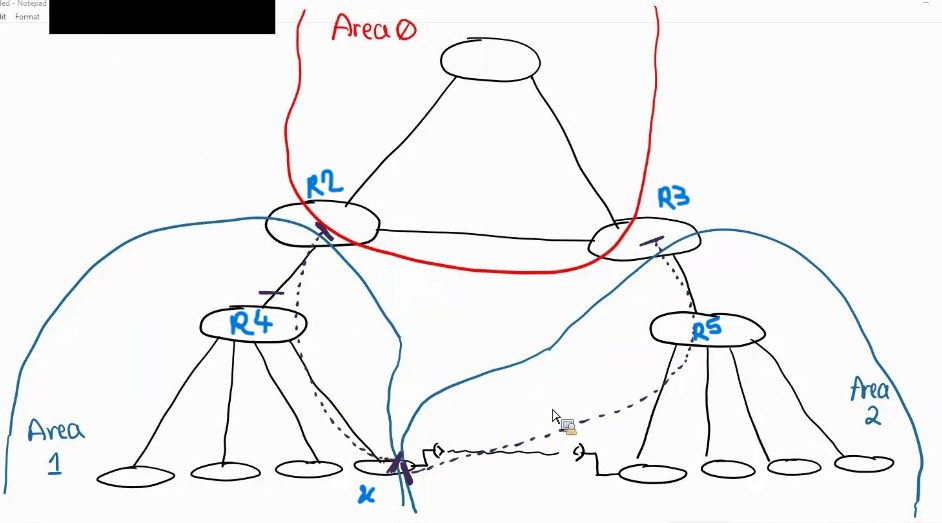
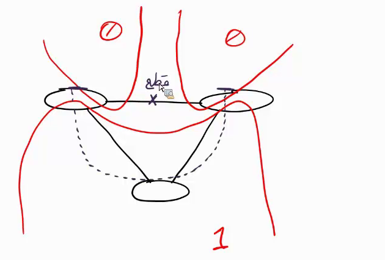

# OSPF Virtual Link
###  قرار شد که Area ها به Area0 وصل شوند ولی با ابزار ویرچوال لینک می توان Area زیر area های غیر صفر داشت.در روتر ABR یک ویرچوال لینک تعریف می کنیم و در روتر ای که در لبه Area غیرقانونی قرار دارد در اونجا هم تعریف می کنیم بعد این دو از تو شکم Area واسط به همدیگر وصل می شن واین Area واسط باید از نوع نورمال باشد با این کار بسته های OSPF نه ترافیم یوزها یعنی Hello,Update,LSA ها از توی این ویرچوال لینک حرکت میکنند و رابطه همسایگی بینشان شکل می گیرد.میتوان برا یریداندنسی دو تا ویرپوال لینک را هاندازی کرد.
### هدف ویرچوال لینک این است که Area هایی که از Area صفر فاصله دارن و نمی توان به Area0 وصل کرد به وسیله یک Area واسط به Area0 وصل کرد.

### در اینجا برای اینکه ارتباطات بین دو ساختمان ریداندنت بشوند یک لینک رادیویی زده شده ولی این لینک بین دو تا Area من افتاده من مرز Area1 را آوردم تا اینجا و مرزArea2 را هم کشیده ام تا اینجا حالا مشکل این است که Area1 نمی تونه به Area2 وصل بشه من یک ویرچوال لینک ار شکم روتر x زدم به ABR R2 که اگر ارتباط بین R3 و R5 ترکید آپدیت های OSPF به وسیله Area1 واسط دوباره به Area0 وصل شن و مجددا یک ویرپوال لینک دیگه از شکم Area2 به ABR R3 زدم تا اگر ارتباط R2 با R4 ترکید ارتباط اینها قطع نشه و از این Area واسط 2 برن.

### کاربرد دیگر ویرچوال لینک دوتا روتر که در Ara0 اند اگر ارتباط بینشون قطع شود Area0 دو تکه میشه و OSPF نمی تونه دو تا Area0 داشته باشد.هدف این است که Area های صفر را به هم وصل کرد.

### در این LAB روتر HQ-1 روتر ABR ما است و Area غیرقانونی Area2 است چون روتر Branch-1 به Area0 وصل نیست الان Area0 و Area1 روت های همدیگر را بلد اند چون قانونی است ولی روت های area2 را یاد نگرفته اند.
### برای حل این مشکل باید در روتر ای که در Area غیر قانونی قرار گرفته یعنی Branch-1 و در Abr قانونی خودم یک ویرچوال لینک بزنم که به وسیاه Area1 این Area2 را به Area0 وصل کند.

```cisco

HQ-1(config)#router ospf 1
HQ-1(config-router)#area 1 virtual-link 3.3.3.3

Branch-1(config)#router ospf 1
Branch-1(config-router)#area 1 virtual-link 1.1.1.1

*May  8 12:11:22.295: %OSPF-5-ADJCHG: Process 1, Nbr 1.1.1.1 on OSPF_VL0 from LOADING to FULL, Loading Done

Branch-1#sh ip ospf neighbor

Neighbor ID     Pri   State           Dead Time   Address         Interface
1.1.1.1           0   FULL/  -           -        1.1.1.1         OSPF_VL0
1.1.1.1           0   FULL/  -        00:00:30    1.1.1.1         Serial2/1
4.4.4.4           1   FULL/DR         00:00:33    1.2.2.2         FastEthernet1/1

Branch-1#sh ip ospf virtual-links
Virtual Link OSPF_VL0 to router 1.1.1.1 is up
  Run as demand circuit
  DoNotAge LSA allowed.
  Transit area 1, via interface Serial2/1
 Topology-MTID    Cost    Disabled     Shutdown      Topology Name
        0           64        no          no            Base
  Transmit Delay is 1 sec, State POINT_TO_POINT,
  Timer intervals configured, Hello 10, Dead 40, Wait 40, Retransmit 5
    Hello due in 00:00:07
    Adjacency State FULL (Hello suppressed)
    Index 1/3, retransmission queue length 0, number of retransmission 0
    First 0x0(0)/0x0(0) Next 0x0(0)/0x0(0)
    Last retransmission scan length is 0, maximum is 0
    Last retransmission scan time is 0 msec, maximum is 0 msec

HQ-1#sh ip ospf virtual-links
Virtual Link OSPF_VL0 to router 3.3.3.3 is up
  Run as demand circuit
  DoNotAge LSA allowed.
  *Transit area 1, via interface Serial2/1
 Topology-MTID    Cost    Disabled     Shutdown      Topology Name
        0           64        no          no            Base
  *Transmit Delay is 1 sec, State POINT_TO_POINT,
  Timer intervals configured, Hello 10, Dead 40, Wait 40, Retransmit 5
    Hello due in 00:00:04
    Adjacency State FULL (Hello suppressed)
    Index 2/3, retransmission queue length 0, number of retransmission 0
    First 0x0(0)/0x0(0) Next 0x0(0)/0x0(0)
    Last retransmission scan length is 0, maximum is 0
    Last retransmission scan time is 0 msec, maximum is 0 msec
	
HQ-1#sh ip ospf neighbor

Neighbor ID     Pri   State           Dead Time   Address         Interface
3.3.3.3           0   FULL/  -           -        1.1.1.2         OSPF_VL0
2.2.2.2           1   FULL/DR         00:00:21    1.0.0.2         FastEthernet0/0
3.3.3.3           0   FULL/  -        00:00:34    1.1.1.2         Serial2/1

```
###  دوبار همسایه شده یکیش با ویرچوال لینک است. نتیجه اینکه روت های همدیگر را یاد گرفته اند

```cisco
Branch-2#sh ip route

      1.0.0.0/8 is variably subnetted, 4 subnets, 2 masks
O IA     1.0.0.0/30 [110/66] via 1.2.2.1, 00:04:53, FastEthernet1/1
O IA     1.1.1.0/30 [110/65] via 1.2.2.1, 00:04:53, FastEthernet1/1
C        1.2.2.0/30 is directly connected, FastEthernet1/1
L        1.2.2.2/32 is directly connected, FastEthernet1/1

