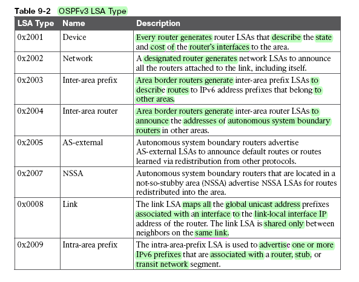
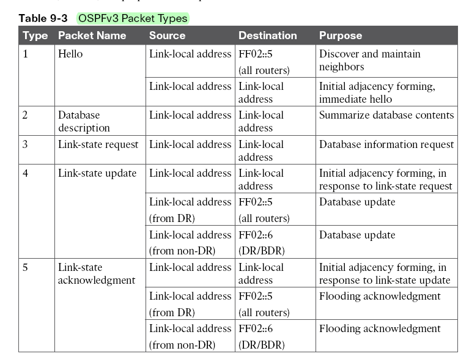
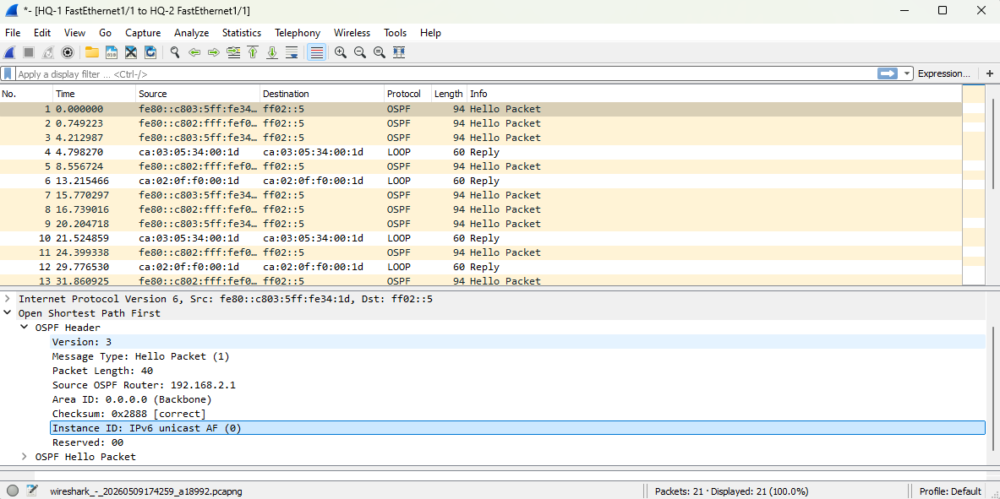
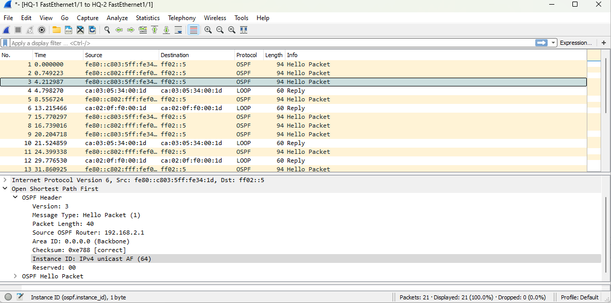
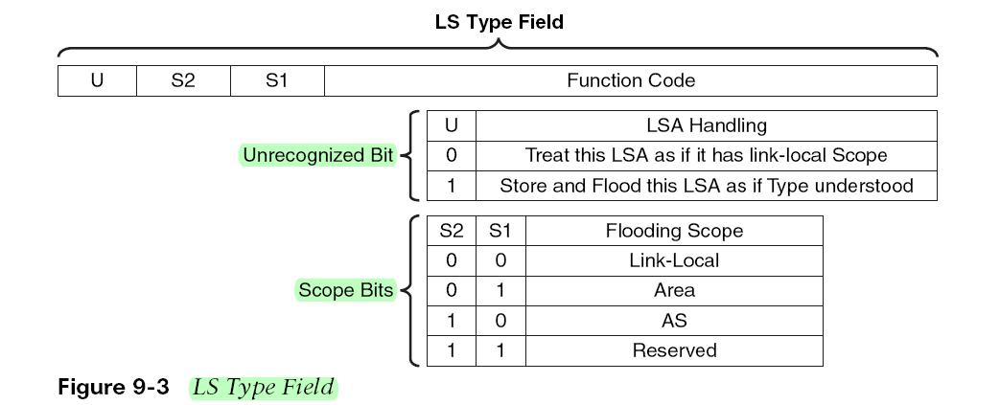
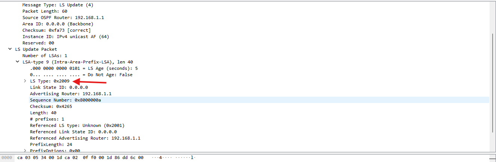

#OSPFV3
### OSPF قبلی V2 بود و در ورژن V3 یکسری تغییرات مثل پشتیبانی از IPV6 اضافه شده.
### در OSPFV3 ما 1-address family  داریم 2-new LSA type ها اضافه شده اند3-Removal of addressing semantics یعنی:
### قبلاً در OSPFv2 توپولوژی یا همون نقشه براساس آدرس های ما ساخته میشد و اگر یکی از این آدرس ها از شبکه ما حذف می شد تمام روترها full SPF Calculation باید انجام میدادند تا مسیریابی را دوباره انجام بدهند چون جزئی از نقشه حذف شده در OSPFV3 نقشه شما روی روتر ID و Link Local Address آی پی های V6 کار میکنند و توپولوژی روی این دو ساخته میشودپس ما Link Local Address را روی دو سر لینک ها و روتر ID داریم و آدرس های IPV4 در توپولوژی وجود ندارند و این آدرس ها معادل سازی میشن پس اگر در OSPFV3 یکی از آدرسها Down شود ما Full SPF Calcluation نداریم وPartical SPF Calculation داریم. این رفتار که آدرسها معادل می شوند با لینک لوکال و روتر ID مثل ISIS به همین دلیل آدرس ها در هدر پکت OSPF نیستند و آدرسها رفته اند در Payload اون LSA در توپولوژی های بزرگ این رفتار خیلی بهبنه تر است.OSPFV3 را نمی توان به تنهایی روی ipv4 راه اندازی کرد چون همه تجهیزات باید Link Local Address داشته باشند و IPV6 را باید enable بکنیم
### ادامه تغییراتی که روی OSPFV3 داریم:4-LSA Flooding: با این مشخص میشه که LSA ها اجازه دارن تا کجا برن. 5-Packet Format: مستقیماً پکت های OSPF روی IPV6اند. 6-router-id: مثل ساختار قبلی با IPV6 هم دارد. 7-Authentication:  در OSPFV3 به وسیله IPSEC اتفاق می افتد پس Secure تره. 8-Neighbor Adjacencis: رابطه همسایگی روی Link Local Address ها اتفاق می افتد. 9-Instance ID: می توان OSPF های مختلف داشت روترها Instance id را در بسته های OSPF می ذارن اگر Instance ID روترها با هم یکسان باشد اون دو با هم همسایه می شن.
### LSA ها کاملاً تغییر پیدا کرده اند به همین دلیل با OSPFV2 کامپتیبل نیستند.


### از 0x2001 تا 0x2007 معادل همان LSA type1-7  است. 0x0008 link این LSA  مپ میکند گلوبال آدرسهایی که روی اینترفیس است را با Link local آدرسهای روی اینترفیس ها - 0x2009 : این LSA آدرسهای IPV6 ای که یک روتر دارد به وسیله این َAdvertize میشه مثلا دست های دیگر روتر که بعضی ها Stub و transitشده اند که روی این ها یکسری IPv6 وجود داد که این LSA type9 این ها را با روتر id معادل سازی میکند. پس این دو آدرس ها را معادل میکنند یکیش آدرس ها را معادل میکند با Link local address و یکی دیگر آدرس هایی که روی روتر است با اون روتر معادل می کند و کلاً آدرس ها به وسیله این دو LSA منقل می شوند.
### آدرس های مالتی کست OSPFV3: 
###FF02::05   FF02::06  که 06 برای DR ها بودند.
### بسته های OSPFV3:

### آدرس های سورس بسته غالباً لینک لوکال میشه و آدرس های مقصد بسته را مثلاً در Hello به FF02::5  در همه روترها ارسال می شه و یا ممکنه به آدرس لینک لوکال روتر روبرو ارسال شه.و یا بسته DBD به آدرس Linklocal address و LSR هم به Linklocal address ارسال میشه و LSU هم به Link local address و هم به FF02::5 و هم بهFF02::6 ارسال میشه.
## OSPF-Dual-Stack
### پایین برنچ بوده و دو روتر بالا دفتر مرکزی ها بودن و دو ارتباط داشته که یکی می تونسته ارتباط اصلی و دیگری ارتباط پشتیبان و ارتباطات WAN بوده و Area ها را جدا کرده ایم. این یک شبکه Dual Stack  است یعنی هم IPV4 و هم IPV6 روش رآنه وهمه چیز دوتایی است لن شبکه ما هم IPV4 و هم IPV6 داره و روترها در ارتباطات WAN شان IPV4 و IPV6 دارن ما شبکه خالص IPV6 نخواهیم داشت نتورک های ما قراره اینطوری Dual Stack شن ipv4 را نمی شه خاموش کرد و رفت سراغIPV6 قراره IPV6 به داستان اضافه شود.

```cisco
HQ-1(config)#router ospfv3 1
HQ-1(config-router)#?
 address-family         Enter Address Family command mode
  area                   OSPF area parameters
  auto-cost              Calculate OSPF interface cost according to bandwidth
  bfd                    BFD configuration commands
  compatible             Compatibility list
  default                Set a command to its defaults
  event-log              Event Logging
  exit                   Exit from routing protocol configuration mode
  graceful-restart       Graceful-restart options
  help                   Description of the interactive help system
  interface-id           Source of the interface ID
  limit                  Limit a specific OSPF feature
  log-adjacency-changes  Log changes in adjacency state
  max-lsa                Maximum number of non self-generated LSAs to accept
  max-metric             Set maximum metric
  no                     Negate a command or set its defaults
  passive-interface      Suppress routing updates on an interface
  queue-depth            Hello/Router process queue depth
  router-id              router-id for this OSPF process
  timers                 Adjust routing timers

```
### اگر روتر آدرس IPV4 نداشت (که چیز عجیبیه) در اینجا باید روتر آیدی را مشخص کنیم و در اینجا چون آدرس IPV4 ای دارد دیگر لازم نیست.
```cisco
HQ-1(config)#router ospfv3 1
HQ-1(config-router)#address-family ipv4 unicast
Router Address Family configuration commands:
  area                   OSPF area parameters
  auto-cost              Calculate OSPF interface cost according to bandwidth
  bfd                    BFD configuration commands
  compatible             Compatibility list
  default                Set a command to its defaults
  default-information    Control distribution of default information
  default-metric         Set metric of redistributed routes
  discard-route          Enable or disable discard-route installation
  distance               Define an administrative distance
  distribute-list        Filter networks in routing updates
  event-log              Event Logging
  exit-address-family    Exit from Address Family configuration mode
  graceful-restart       Graceful-restart options
  help                   Description of the interactive help system
  interface-id           Source of the interface ID
  limit                  Limit a specific OSPF feature
  log-adjacency-changes  Log changes in adjacency state
  max-lsa                Maximum number of non self-generated LSAs to accept
  max-metric             Set maximum metric
  maximum-paths          Forward packets over multiple paths
  no                     Negate a command or set its defaults
  passive-interface      Suppress routing updates on an interface
  queue-depth            Hello/Router process queue depth
  redistribute           Redistribute information from another routing protocol
  router-id              router-id for this OSPF process
  snmp                   Modify snmp parameters
  summary-prefix         Configure IP address summaries
  timers                 Adjust routing timers
```
### در اینجا هم همان دستورات را داریم اگر دستورات بالا را بزنیم در مورد همه Address Family ها صادق است اگر در IPV4 بزنیم در مورد این Address Family  ها صادقه
```cisco
HQ-1(config)#router ospfv3 1
HQ-1(config-router)#address-family ipv4 unicast
HQ-1(config-router-af)#passive-interface fastEtherne 0/0
HQ-1(config-router-af)#exit

HQ-1(config-router)#address-family ipv6 unicast
HQ-1(config-router-af)#passive-interface fastEtherne 0/0

```
### بقیه دستورات زیر اینترفیس ها میخوره
```cisco
HQ-1(config)#interface fastEthernet 0/0
HQ-1(config-if)#ospfv3 1 ipv4 area 0
HQ-1(config-if)#ospfv3 1 ipv6 area 0
HQ-1(config-if)#exit

HQ-1(config)#interface fastEthernet 1/1
HQ-1(config-if)#ospfv3 1 ipv4 area 0
HQ-1(config-if)#ospfv3 1 ipv6 area 0

HQ-1(config)#interface serial 2/1
HQ-1(config-if)#ospfv3 1 ipv4 area 1
HQ-1(config-if)#ospfv3 1 ipv6 area 1
HQ-1(config-if)#exit

HQ-1#sh ip protocols
*** IP Routing is NSF aware ***

Routing Protocol is "ospfv3 1"
  Outgoing update filter list for all interfaces is not set
  Incoming update filter list for all interfaces is not set
  Router ID 192.168.1.1
  Area border router
  Number of areas: 2 normal, 0 stub, 0 nssa
  Interfaces (Area 0):
    FastEthernet1/1
    FastEthernet0/0
  Interfaces (Area 1):
    Serial2/1
  Maximum path: 4
  Routing Information Sources:
    Gateway         Distance      Last Update
  Distance: (default is 110)

```
### دستورات مربوط به HQ-2
```cisco

HQ-2(config)#router ospfv3 1

HQ-2(config-router)#address-family ipv4 unicast
HQ-2(config-router-af)#passive-interface fastEthernet 0/0
HQ-2(config-router-af)#exit

HQ-2(config-router)#address-family ipv6 unicast
HQ-2(config-router-af)#passive-interface fastEthernet 0/0
HQ-2(config-router-af)#exit

HQ-2(config)#inter fastEthernet 0/0
HQ-2(config-if)#ospfv3 1 ipv4 area 0
HQ-2(config-if)#ospfv3 1 ipv6 area 0
HQ-2(config-if)#exit
HQ-2(config)#inter fastEthernet 1/1
HQ-2(config-if)#ospfv3 1 ipv4 area 0

*May  9 17:09:35.831: %OSPFv3-5-ADJCHG: Process 1, IPv4, Nbr 192.168.1.1 on FastEthernet1/1 from LOADING to FULL, Loading Done

HQ-2(config-if)#ospfv3 1 ipv6 area 0

*May  9 17:10:00.483: %OSPFv3-5-ADJCHG: Process 1, IPv6, Nbr 192.168.1.1 on FastEthernet1/1 from LOADING to FULL, Loading Done

HQ-2(config)#interface serial 2/2
HQ-2(config-if)#ospfv3 1 ipv4 area 1
HQ-2(config-if)#ospfv3 1 ipv6 area 1
HQ-2(config-if)#exit
```
### دستورات مربوط به روتر Branch
```cisco
Branch(config)#router ospfv3 1
Branch(config-router)#address-family ipv4 unicast
Branch(config-router-af)#passive-interface fastEthernet 0/0
Branch(config-router-af)#exit

Branch(config-router)#address-family ipv6 unicast
Branch(config-router-af)#passive-interface fastEthernet 0/0
Branch(config-router-af)#exit

Branch(config)#interface serial 2/1
Branch(config-if)#ospfv3 1 ipv4 area 1

*May  9 17:11:26.347: %OSPFv3-5-ADJCHG: Process 1, IPv4, Nbr 192.168.1.1 on Serial2/1 from LOADING to FULL, Loading Done

Branch(config-if)#ospfv3 1 ipv6 area 1

*May  9 17:12:11.159: %OSPFv3-5-ADJCHG: Process 1, IPv6, Nbr 192.168.1.1 on Serial2/1 from LOADING to FULL, Loading Done

Branch(config)#interface serial 2/2
Branch(config-if)#ospfv3 1 ipv4 area 1

*May  9 17:13:16.739: %OSPFv3-5-ADJCHG: Process 1, IPv4, Nbr 192.168.2.1 on Serial2/2 from LOADING to FULL, Loading Done

Branch(config-if)#ospfv3 1 ipv6 area 1

*May  9 17:13:28.079: %OSPFv3-5-ADJCHG: Process 1, IPv6, Nbr 192.168.2.1 on Serial2/2 from LOADING to FULL, Loading Done

Branch(config)#interface fastEthernet 0/0
Branch(config-if)#ospfv3 1 ipv4 area 1
Branch(config-if)#ospfv3 1 ipv6 area 1
```
### دستورات verification
```cisco

Branch#show ospfv3 neighbor

          OSPFv3 1 address-family ipv4 (router-id 192.168.10.1)

Neighbor ID     Pri   State           Dead Time   Interface ID    Interface
192.168.2.1       0   FULL/  -        00:00:31    7               Serial2/2
192.168.1.1       0   FULL/  -        00:00:34    6               Serial2/1

          OSPFv3 1 address-family ipv6 (router-id 192.168.10.1)

Neighbor ID     Pri   State           Dead Time   Interface ID    Interface
192.168.2.1       0   FULL/  -        00:00:24    7               Serial2/2
192.168.1.1       0   FULL/  -        00:00:29    6               Serial2/1

Branch#sh ospfv3 ipv4 neighbor

          OSPFv3 1 address-family ipv4 (router-id 192.168.10.1)

Neighbor ID     Pri   State           Dead Time   Interface ID    Interface
192.168.2.1       0   FULL/  -        00:00:32    7               Serial2/2
192.168.1.1       0   FULL/  -        00:00:39    6               Serial2/1


Branch#show ospfv3 database

          OSPFv3 1 address-family ipv4 (router-id 192.168.10.1)

                Router Link States (Area 1)

ADV Router       Age         Seq#        Fragment ID  Link count  Bits
 192.168.1.1     842         0x80000002  0            1           B
 192.168.2.1     732         0x80000002  0            1           B
 192.168.10.1    731         0x80000002  0            2           None

                Inter Area Prefix Link States (Area 1)

ADV Router       Age         Seq#        Prefix
 192.168.1.1     1789        0x80000001  3.3.3.0/30
 192.168.1.1     1789        0x80000001  192.168.1.0/24
 192.168.1.1     1151        0x80000001  192.168.2.0/24
 192.168.2.1     1103        0x80000001  192.168.1.0/24
 192.168.2.1     1103        0x80000001  192.168.2.0/24
 192.168.2.1     1103        0x80000001  3.3.3.0/30

                Link (Type-8) Link States (Area 1)

ADV Router       Age         Seq#        Link ID    Interface
 192.168.10.1    556         0x80000001  2          Fa0/0
 192.168.2.1     1103        0x80000001  7          Se2/2
 192.168.10.1    731         0x80000001  7          Se2/2
 192.168.1.1     1789        0x80000001  6          Se2/1
 192.168.10.1    842         0x80000001  6          Se2/1

                Intra Area Prefix Link States (Area 1)

ADV Router       Age         Seq#        Link ID    Ref-lstype  Ref-LSID
 192.168.1.1     1789        0x80000001  0          0x2001      0
 192.168.2.1     1103        0x80000001  0          0x2001      0
 192.168.10.1    556         0x80000003  0          0x2001      0

          OSPFv3 1 address-family ipv6 (router-id 192.168.10.1)

                Router Link States (Area 1)

ADV Router       Age         Seq#        Fragment ID  Link count  Bits
 192.168.1.1     797         0x80000002  0            1           B
 192.168.2.1     720         0x80000002  0            1           B
 192.168.10.1    720         0x80000002  0            2           None

                Inter Area Prefix Link States (Area 1)

ADV Router       Age         Seq#        Prefix
 192.168.1.1     1758        0x80000001  FDBB:A::/64
 192.168.1.1     1758        0x80000001  FDAA:AAAA::/64
 192.168.1.1     1108        0x80000001  FDAA:BBBB::/64
 192.168.2.1     1095        0x80000001  FDAA:AAAA::/64
 192.168.2.1     1095        0x80000001  FDAA:BBBB::/64
 192.168.2.1     1095        0x80000001  FDBB:A::/64

                Link (Type-8) Link States (Area 1)

ADV Router       Age         Seq#        Link ID    Interface
 192.168.10.1    547         0x80000001  2          Fa0/0
 192.168.2.1     1095        0x80000001  7          Se2/2
 192.168.10.1    720         0x80000001  7          Se2/2
 192.168.1.1     1758        0x80000001  6          Se2/1
 192.168.10.1    797         0x80000001  6          Se2/1

                Intra Area Prefix Link States (Area 1)

ADV Router       Age         Seq#        Link ID    Ref-lstype  Ref-LSID
 192.168.1.1     1758        0x80000001  0          0x2001      0
 192.168.2.1     1095        0x80000001  0          0x2001      0
 192.168.10.1    547         0x80000003  0          0x2001      0

Branch#show ospfv3 interface brief
Interface    PID   Area            AF         Cost  State Nbrs F/C
Fa0/0        1     1               ipv4       1     DR    0/0
Se2/2        1     1               ipv4       64    P2P   1/1
Se2/1        1     1               ipv4       64    P2P   1/1
Fa0/0        1     1               ipv6       1     DR    0/0
Se2/2        1     1               ipv6       64    P2P   1/1
Se2/1        1     1               ipv6       64    P2P   1/1

Branch#show ipv6 route

C   FDAA:1111::/64 [0/0]
     via FastEthernet0/0, directly connected
L   FDAA:1111::1/128 [0/0]
     via FastEthernet0/0, receive
OI  FDAA:AAAA::/64 [110/65]
     via FE80::C802:FFF:FEF0:0, Serial2/1
OI  FDAA:BBBB::/64 [110/65]
     via FE80::C803:5FF:FE34:0, Serial2/2
C   FDBB:1::/64 [0/0]
     via Serial2/1, directly connected
L   FDBB:1::2/128 [0/0]
     via Serial2/1, receive
C   FDBB:2::/64 [0/0]
     via Serial2/2, directly connected
L   FDBB:2::2/128 [0/0]
     via Serial2/2, receive
OI  FDBB:A::/64 [110/65]
     via FE80::C802:FFF:FEF0:0, Serial2/1
     via FE80::C803:5FF:FE34:0, Serial2/2
L   FF00::/8 [0/0]
     via Null0, receive
	 
Branch#show ip route

      1.0.0.0/8 is variably subnetted, 3 subnets, 2 masks
C        1.1.1.0/30 is directly connected, Serial2/1
C        1.1.1.1/32 is directly connected, Serial2/1
L        1.1.1.2/32 is directly connected, Serial2/1
      2.0.0.0/8 is variably subnetted, 3 subnets, 2 masks
C        2.2.2.0/30 is directly connected, Serial2/2
C        2.2.2.1/32 is directly connected, Serial2/2
L        2.2.2.2/32 is directly connected, Serial2/2
      3.0.0.0/30 is subnetted, 1 subnets
O IA     3.3.3.0 [110/65] via 2.2.2.1, 00:11:39, Serial2/2
                 [110/65] via 1.1.1.1, 00:11:39, Serial2/1
O IA  192.168.1.0/24 [110/65] via 1.1.1.1, 00:11:39, Serial2/1
O IA  192.168.2.0/24 [110/65] via 2.2.2.1, 00:11:39, Serial2/2
      192.168.10.0/24 is variably subnetted, 2 subnets, 2 masks
C        192.168.10.0/24 is directly connected, FastEthernet0/0
L        192.168.10.1/32 is directly connected, FastEthernet0/0
```
### کپچر روی FA1/1  برای HQ-1 که یکی برای ipv4 و دیگری برای ipv6 است و کلا کامونیکیشن روی IPv6 اتفاق می افتد.


## Route summarization
### قوانین روت سامریزیشن در OSPFV2 در اینجا هم هست.

```cisco
HQ-2(config)#router ospfv3 1
HQ-2(config-router)#address-family ipv6 unicast
HQ-2(config-router-af)#area 0 range 2001:db8:0:0::/65
```
##OSPFv3 Network Type
###همون نتورک تایپ های قبلی را اینجا هم داریم و زیر اینترفیس میزنیم(همون ماجرایی کهDR انتخاب می شه و نمیشه اینجا هم وجود دارد)
```cisco
R2(config)# interface GigabitEthernet 0/3
ospfv3 network {point-to-point | point-to-multipoint broadcast | nonbroadcast} 
```
##OSPFv3 Authentication
###OSPFV3 به وسیله IPSEC اتفاق می افتدو میتوان دو مدل IPSec پیاده سازی کرد 1-AH فقط Auth را پشتیبانی می کند و Enc ندارد2-ESP هم Auth و هم enc را پشتیبانی می کند. 
### در این لب  بین دو روتر HQ-1 و Branch میخواهیم auth فعال کنم و به روش ESP
```cisco
HQ-1(config)#inter se2/1
HQ-1(config-if)#ospfv3 encryption ipsec spi 256 esp aes-cbc 128 12345678901234567890123456789012 sha1 1234567890123456789012345678901234567890 

%OSPFv3-5-ADJCHG: Process 1, IPv6, Nbr 192.168.10.1 on Serial2/1 from FULL to DOWN, Neighbor Down: Dead timer expired

Branch(config)#inter se2/1
Branch(config-if)#ospfv3 encryption ipsec spi 256 esp aes-cbc 128 12345678901234567890123456789012 sha1 1234567890123456789012345678901234567890

May 10 12:13:38.263: %OSPFv3-5-ADJCHG: Process 1, IPv6, Nbr 192.168.1.1 on Serial2/1 from LOADING to FULL, Loading Done

Branch#show  ospfv3 interface serial 2/1
Serial2/1 is up, line protocol is up

  AES-CBC-128 encryption SHA-1 auth SPI 256, secure socket UP (errors: 0)

```
### راه اندازی با روش Authentication

```cisco
HQ-2(config)#interface serial 2/2
HQ-2(config-if)#ospfv3 authentication ipsec spi 512 sha1 1234567890123456789012345678901234567890

 %OSPFv3-5-ADJCHG: Process 1, IPv6, Nbr 192.168.10.1 on Serial2/2 from FULL to DOWN, Neighbor Down: Dead timer expired
 %OSPFv3-5-ADJCHG: Process 1, IPv4, Nbr 192.168.10.1 on Serial2/2 from FULL to DOWN, Neighbor Down: Dead timer expired

Branch(config)#inter serial 2/2
Branch(config-if)#ospfv3 authentication ipsec spi 512 sha1 1234567890123456789012345678901234567890

 %OSPFv3-5-ADJCHG: Process 1, IPv6, Nbr 192.168.2.1 on Serial2/2 from LOADING to FULL, Loading Done
 %OSPFv3-5-ADJCHG: Process 1, IPv4, Nbr 192.168.2.1 on Serial2/2 from LOADING to FULL, Loading Done

```
### طول کلید نباید تکراری باشد قبلی 256 انتخاب کردیم آخری را 512، می توان دستور Auth  را مثل مثال کتاب زیر Router ospfv3  زد و Area0  را encrypt کرد.اگر در سطح Area پیاده سازی کنیم تمام اینترفیس هایی که تو اون Area هستند را شامل می شود.
```cisco

router ospfv3 100
area 0 encryption ipsec spi 500 esp 3des 1234567890123456789012345678901234567
8901234567 sha1 0123456789012345678901234567890123456789
! The ospfv3 encryption rolls over to two lines in the example, but it is
! entered as one long command. The running configuration will display the
! password encrypted

```
### اینترفیس ها در ipv6 میتوانند آدرس IPV6 هم نداشته باشند چون مثل Eigrp این ها با Link Local Address اینترفیس ها کار دارند نه با آدرس واقعی اینترفیس ها.پس ما در LAB میتوانیم آدرس های IPV6 را از روی ارتباطات بین روترها حذف کنیم و کلی کارم سبک تر می شه البته از قبل باید IPV6 روی اینترفیس هاEnable باشه.
```cisco
HQ-1(config)#inter serial 2/1
HQ-1(config-if)#ipv6 enable
HQ-1(config-if)#no ipv6 address FDBB:1::1/64

HQ-1(config)#inter serial 2/1
Branch(config-if)#ipv6 enable
Branch(config-if)#no ipv6 address FDBB:1::2/64
```
## OSPF LSA Flooding Scope
### LSA های OSPF وقتی پروپکیت می شن در شبکه و بین روترها پخش میشن میرن جلو با این Flooding Scope  مشخص میکنیم تا کجا برن جلو LSA ها و انواع مختلفی داریم
### 1-Link Local: اگر دوتا روتر داشته باشیم و یکی از روترها یک LSA بده و فلادینگ اسکوب اش Link Local باشد lsa را این روتر می گیرد و تمام(فقط بین دو روتر Share مییشه)
### 2-Area Scope: اگر یک LSA فلادینگ اسکوب اش Area باشد LSA بین روترهایی که تو یک Area هستند جلو میره
### 3-Autonomus System Scope: این LSA تو کل شبکه ات میره

###  ما یک فیلدی داریم به نام LSA type Field اولش بیتی به نام U  داریم که این مشخص میکند اگر یک روتر LSA را نمی شناخت چه جوری هندلش کند یعنی یک LSA تایپ ناشناخته داشت  چه رفتاری باهاش کند اگر مقدار بیت صفر باشد باهاش رفتار Link Local ای انجام میده و اگر یک باشد Store و flood اش میکند اگر ما به روتر HQ-1 وادار کنیم که یک LSA بده :

```cisco
HQ-1(config)#interface fastEthernet 0/0
HQ-1(config-if)#shutdown
HQ-1(config-if)#no shutdown

```

### این 0x2009 سمت چپ یعنی 2 اینهاflooding scope اند 2 یعنی در سطح یک Area اند در مقابل 4 که در سطح یک AS اند اونایی که صفر اند طبق جدول زیر در سطح لینک اند.

  

HQ-1#show ospfv3 ipv4 database router


  Options: (E-Bit, R-bit, DC-Bit, AF-Bit)

```

### DC-Bit: اجازه میده که روتر Hello نفرسته روی اینترفیس هایی که سرعتش کمه هلو نفرسته.
### MC: یعنی MOSPF را روترت پشتیبانی میکند(مالتی کست)
### N یعنی روترت LSA تایپ7 را پشتیبانی می کند این مربوط به Area تایپ های NSSA است.

 

